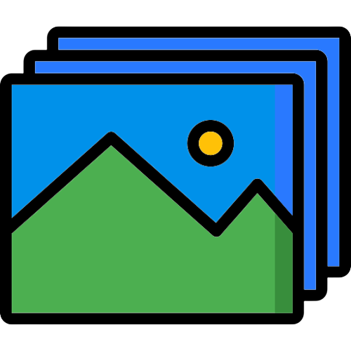
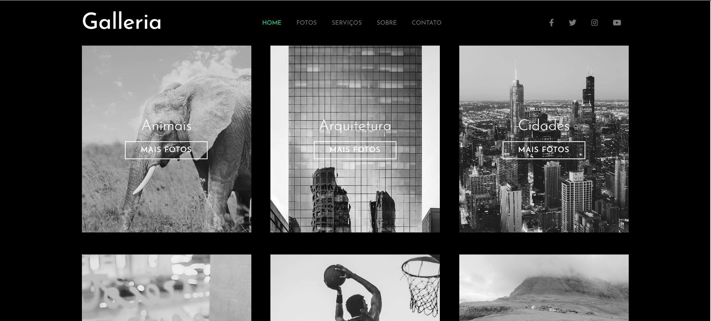

<h1 align="center"><em>Projeto 1</em></h1>

     
   
   

Aplicação desenvolvida com conhecimentos adquiridos com o SASS

 <a href="#sobre-o-projeto">Sobre o Projeto</a> •
 <a href="#autor">Autor</a>

---

 
   <a href="galleria-sass-delta.vercel.app" target="_blank">VISUALIZAR PROJETO</a>

## Sobre o projeto

O projeto tem como objetivo o estudo e desenvolvimento de uma aplicação com SASS para criar uma exposição de imagens de vários temas.

Aplicou-se assuntos desde a declaração de váriavéis que foram reutilizadas em todo o código, aninhamento de seletores dentro de outros seletores
Mixins para agrupar um conjunto de declarações de estilo, bem como Importação de arquivos, onde foi subdivido o sass em vários arquivos para facilitar a 
manutenção, entre outros...

foi desenvolvido como desafio prático da aula do curso do canal [matheusbattisti - hora de codar](https://www.youtube.com/@MatheusBattisti) .

## Autor

Feito por Nathan Silva 👋🏽 Entre em contato!

<h1 align="center"><em>Projeto 2</em></h1>
<table align="center">
  <tr>
    <td align="center">
      
    </td>
    <td align="center">
      
    </td>
  </tr>
</table>

Aplicação desenvolvida com conhecimentos adquiridos com o SASS

 <a href="#sobre-o-projeto">Sobre o Projeto</a> •
 <a href="#autor">Autor</a>

---

 
   <a href="galleria-sass-delta.vercel.app" target="_blank">VISUALIZAR PROJETO</a>

## Sobre o projeto

O projeto tem como objetivo o estudo e desenvolvimento de uma aplicação com SASS para criar uma exposição de imagens de vários temas.

Aplicou-se assuntos desde a declaração de váriavéis que foram reutilizadas em todo o código, aninhamento de seletores dentro de outros seletores
Mixins para agrupar um conjunto de declarações de estilo, bem como Importação de arquivos, onde foi subdivido o sass em vários arquivos para facilitar a 
manutenção, entre outros...

foi desenvolvido como desafio prático da aula do curso do canal [matheusbattisti - hora de codar](https://www.youtube.com/@MatheusBattisti) .

## Autor

Feito por Nathan Silva 👋🏽 Entre em contato!

electrum-liart.vercel.app
wisetech.vercel.app
